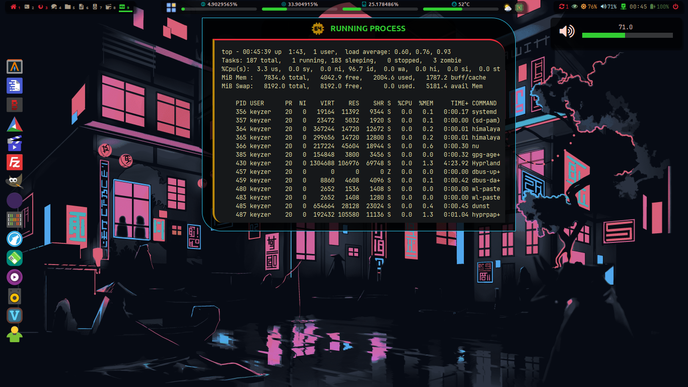

# Hyprwwland

A simple sharing of my [eww](https://github.com/elkowar/eww) setup on Hyprland to serve as an example or basis for learning how to create your own desktop environment. Many thanks to [@ElKowar](https://github.com/elkowar) for this awesome standalone widget system made in Rust. To be used without moderation.

<a href="https://raw.githubusercontent.com/grm34/Hyprwwland/main/assets/screenshots/screen1.png">
  
</a>
<a href="https://raw.githubusercontent.com/grm34/Hyprwwland/main/assets/screenshots/screen2.png">
  
</a>

https://github.com/grm34/Hyprwwland/assets/6394023/c0e354b1-1dce-44f7-9534-fda2981d512b

In order to keep this clean, and being only an eww configuration, my dotfiles are on a separate repository [Hyprwwland-dotfiles](https://github.com/grm34/Hyprwwland-dotfiles).

## What I use

<details>
  <summary>CLICK TO EXPAND</summary>

| Type | Link |
| --- | --- |
| **Distro** | [arch](https://wiki.archlinux.org) |
| **AUR Helper** | [paru](https://github.com/Morganamilo/paru) |
| **Compositor** | [hyprland](https://wiki.hyprland.org) |
| **Widgets** | [eww](https://github.com/elkowar/eww) |
| **Notifications** | [dunst](https://github.com/dunst-project/dunst) |
| **Clipboard** | [wl-clipboard](https://github.com/bugaevc/wl-clipboard) [cliphist](https://github.com/sentriz/cliphist) |
| **Lock Screen** | [swayidle](https://github.com/swaywm/swayidle) [swaylock-effects](https://github.com/mortie/swaylock-effects) |
| **Sound** | [pipewire](https://docs.pipewire.org) [wireplumber](https://gitlab.freedesktop.org/pipewire/wireplumber) [pulsemixer](https://github.com/GeorgeFilipkin/pulsemixer) [myxer](https://github.com/VixenUtils/Myxer) |
| **Brightness Control** | [light](https://haikarainen.github.io/light) (archived 02/04/23) |
| **Wallpaper Manager** | [hyprpaper](https://github.com/hyprwm/hyprpaper) |
| **App Launcher** | [fuzzel](https://codeberg.org/dnkl/fuzzel) |
| **File Manager** | [felix](https://kyoheiu.dev/felix) |
| **Core Utilities** | [coreutils](https://github.com/uutils/coreutils) (rust rewrite) |
| **System info** |  [neofetch](https://github.com/dylanaraps/neofetch) [duf](https://github.com/muesli/duf) [macchina](https://github.com/Macchina-CLI/macchina) |
| **Monitoring** | [btop](https://github.com/aristocratos/btop) [htop](https://github.com/htop-dev/htop) [bandwhich](https://github.com/imsnif/bandwhich) [sniffnet](https://github.com/GyulyVGC/sniffnet) |
| **Shell** | [nushell](https://www.nushell.sh) |
| **Terminal** | [alacritty](https://alacritty.org) |
| **Terminal Prompt** | [starship](https://starship.rs) |
| **Terminal Tools** | [zellij](https://zellij.dev) [zoxide](https://github.com/ajeetdsouza/zoxide) [vivid](https://github.com/sharkdp/vivid) [broot](https://github.com/Canop/broot) | |
| **Terminal Pager** | [bat](https://github.com/sharkdp/bat) [less](https://greenwoodsoftware.com/less) [most](https://www.jedsoft.org/most) [delta](https://github.com/dandavison/delta) |
| **Text Editor** | [helix](https://helix-editor.com) |
| **Network** | [networkmanager](https://www.networkmanager.dev) |
| **VPN** | [wireguard](https://www.wireguard.com) |
| **Multimedia Support** | [gstreamer](https://gitlab.freedesktop.org/gstreamer/gstreamer) [ffmpeg](https://ffmpeg.org) [mpv](https://mpv.io) |
| **Music Player** | [termusic](https://github.com/tramhao/termusic) |
| **Media Downloader** | [yt-dlp](https://github.com/yt-dlp/yt-dlp) |
| **Web Browser** | [librewolf](https://librewolf.net) |
| **Screenshots** | [hyprshot](https://github.com/Gustash/hyprshot) [grim](https://wayland.emersion.fr/grim) [slurp](https://wayland.emersion.fr/slurp) |
| **Screen Recorder** | [wayfarer](https://github.com/stronnag/wayfarer) |
| **Image Viewer** | [feh](https://github.com/derf/feh) |
| **Image Editor** | [gimp](https://www.gimp.org) |
| **Color Picker** | [hyprpicker](https://github.com/hyprwm/hyprpicker) |
| **Document Viewer** | [zathura](https://git.pwmt.org/pwmt/zathura) |
| **Cursors** | [capitaine-cursors](https://github.com/keeferrourke/capitaine-cursors) |
| **Fonts** | [Nerd Fonts](https://www.nerdfonts.com) |
| **Icons** | [papirus-icon-theme](https://github.com/PapirusDevelopmentTeam/papirus-icon-theme) |
| **Themes** | [breeze-gtk](https://invent.kde.org/plasma/breeze-gtk) [adwaita-qt](https://github.com/FedoraQt/adwaita-qt) [Catppuccin](https://github.com/catppuccin/catppuccin) |
| **GUI Settings Editor** | [nwg-look](https://github.com/nwg-piotr/nwg-look) [qt5ct](https://sourceforge.net/projects/qt5ct) [qt6ct](https://github.com/trialuser02/qt6ct) |
| **Desktop Portal** | [xdg-desktop-portal-hyprland](https://github.com/hyprwm/xdg-desktop-portal-hyprland) |
| **Xmpp Client** | [gajim](https://gajim.org) |
</details>

## Quick Install on Arch Linux

- Install eww and Hyprland with the minimum requirements :

```bash
paru --needed -S hyprland eww-wayland dunst libnotify libcanberra\
                 hyprpaper swayidle swaylock-effects-git neofetch duf\
                 wl-clipboard cliphist pulsemixer myxer-bin light jaq\
                 networkmanager sound-theme-freedesktop socat fd
```

- Install required fonts :

```bash
paru --needed -S ttf-anonymouspro-nerd ttf-jetbrains-mono-nerd\
                 ttf-ubuntu-nerd ttf-meslo-nerd papirus-icon-theme
```

- Clone the repository in your `$HOME` config folder :

```bash
git clone https://github.com/grm34/Hyprwwland "$HOME/.config/eww"
```

## Configuring

The [config](config.json) is located in `~/.config/eww/config.json`.

```json
"aur_helper": "paru",
"terminal": "alacritty",
"terminal_cmd": "alacritty -e",
"web_browser": "librewolf",

(...)
```

To be notified of new updates allow `paru` to be runned without password in `~/etc/sudoers` :

```bash
<username> ALL=(ALL) NOPASSWD: /usr/bin/paru
```

## Auto-start with Hyprland

- Edit `~/.config/hypr/hyprland.conf` :

```text
exec-once = wl-paste --type text --watch cliphist store
exec-once = wl-paste --type image --watch cliphist store
exec-once = dunst
exec-once = hyprpaper
exec-once = eww open-many topbar dock
```

- Create `~/.config/hypr/hyprpaper.conf` :

```text
preload = ~/.config/eww/assets/wallpapers/od_neon.png
preload = ~/.config/eww/assets/wallpapers/od_tokyo.jpg
wallpaper = ~/.config/eww/assets/wallpapers/od_neon.png
```

## What else

- Workspace manager that makes it easy to see the status of occupied spaces.
- Real-time monitoring of processor, memory, sensors and disk usage.
- Application launcher + dock which can be used for favorite applications.
- Display of pending updates with the possibility to update in one click.
- Quick access to volume and screen brightness controls.
- Display of the local weather in terminal mode.
- Power menu, network devices, sleep control and much more to come.
- Easily customizable with simple CSS/SCSS.
- Pick up everything you need, it's free.

